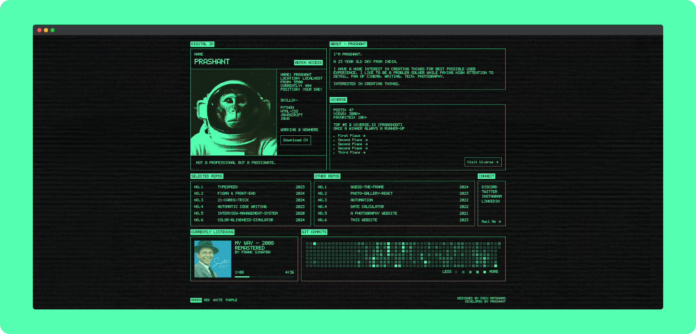
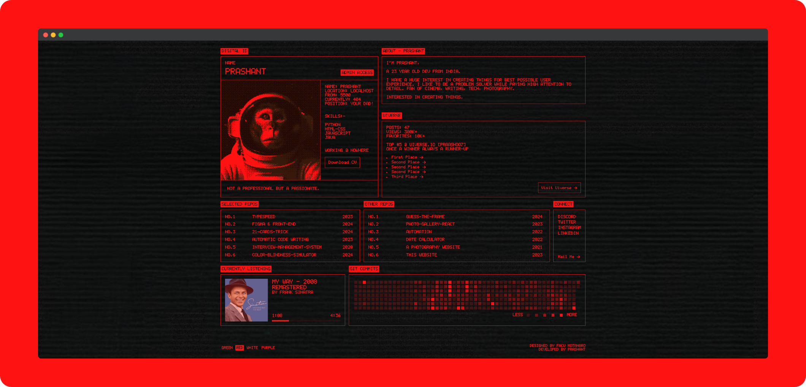
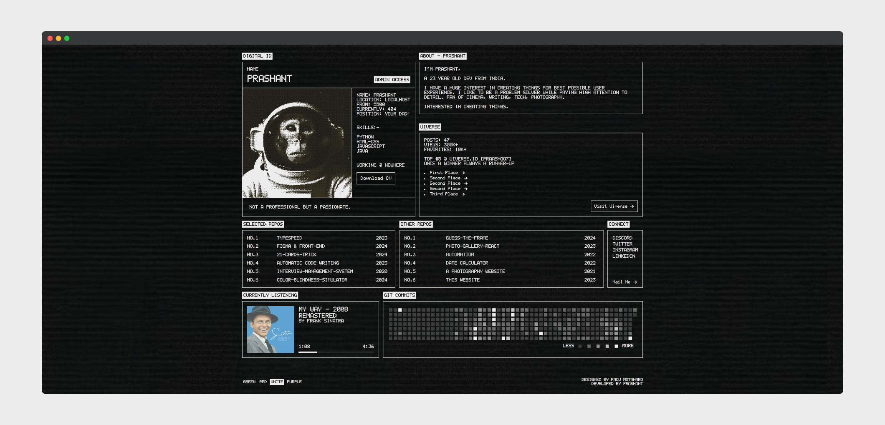
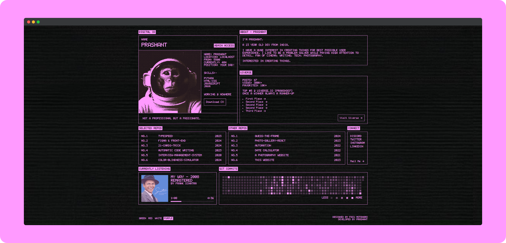

# [I-Liked-a-Design-Part-2](https://praashoo7.github.io/I-Liked-a-Design-Part-2/)

 
 
 

## Info

This Portfolio is designed by Facu Motanaro, unlike my original portfolio, which is designed by me. I am developing some of the designs that I just can't resist bringing to life! Check out my Original Portfolio below and also check out Facu Motanaro's portfolio!  
Facu Motanaro's [Portfolio](https://facumontanaro.com/) 
My [Portfolio](https://praashoo7.github.io/Portfolio/)

## Credits

  - Designed by [Facu Motanaro](https://facumontanaro.com/)
  - Design [Link](https://x.com/facumontanaro_/status/1833155791777378475)
  - LcdSolid font from [FontSpace](https://www.fontspace.com/)
  - Icons from [SVGRepo.](https://www.svgrepo.com/)

## License

This project showcases a portfolio design originally created by Facu Motanaro.
The HTML, CSS, and JavaScript implementation is the work of Prashant.
All rights reserved. 

The design rights belong to Facu Motanaro, and the code copyright belongs to Prashant.
Neither the design nor the code in this repository may be used, copied, modified, or distributed without the explicit permission of both Prashant and Facu Motanaro.

Design: Facu Motanaro
Code Implementation: © 2024 Prashant
