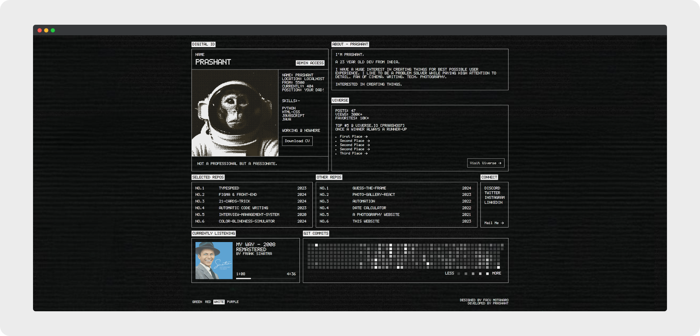

# [I-Liked-a-Design-Part-2](https://praashoo7.github.io/I-Liked-a-Design-Part-2/)

 
 
 

## Info

This Portfolio is designed by Facu Motanaro, unlike my original portfolio, which is designed by me. I am developing some of the designs that I just can't resist bringing to life! Check out my Original Portfolio below and also check out Facu Motanaro's portfolio!

## Credits

  - Designed by [Facu Motanaro]/(https://facumontanaro.com/)
  - Design [Link](https://x.com/facumontanaro_/status/1833155791777378475)

## License

I-Liked-a-Design-Part-2 is open-source Software Licensed under the [MIT License](https://github.com/Praashoo7/I-Liked-a-Design-Part-2/blob/main/LICENSE)
